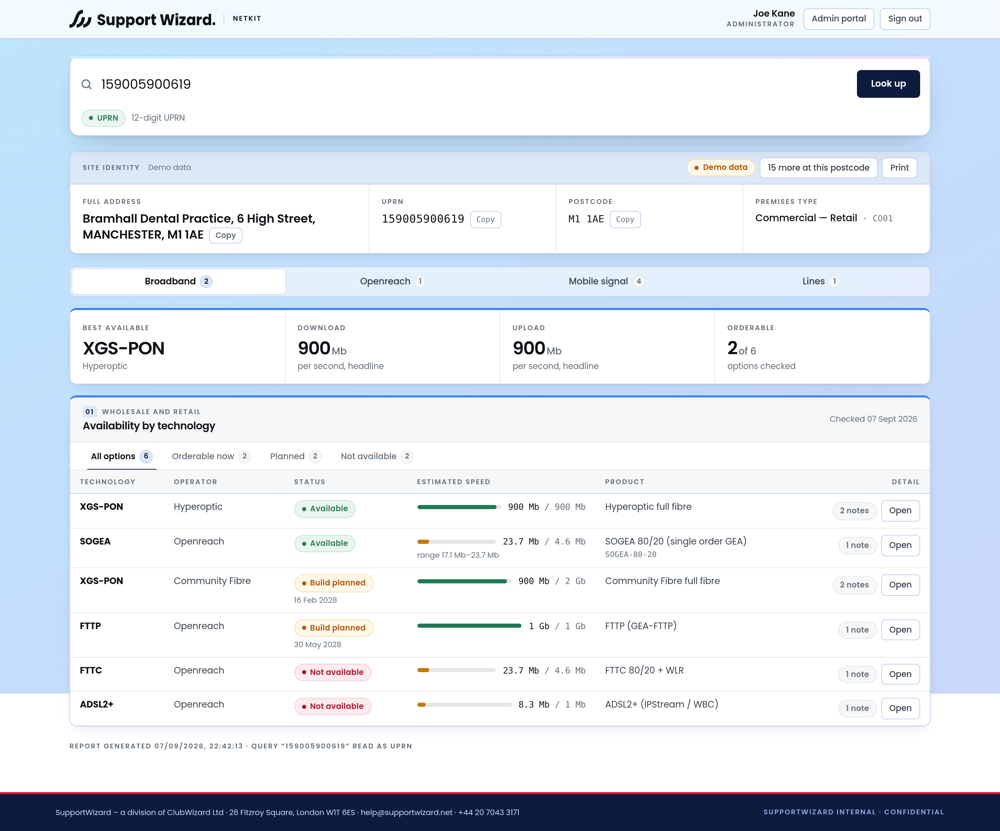

# SupportWizard NetKit

**Everything about a site or a line, from one search box.**

Type a postcode, the first line of an address, a UPRN, a phone number, an
Openreach access line ID, a service ID or an ONT serial. NetKit works out
what you typed, resolves it to a premises, and returns the full address and
UPRN alongside what can be ordered there, what mobile signal to expect, and
every line already in place.



---

## What it does

| | |
| --- | --- |
| **One search box** | Classifies what you typed locally as you type — postcode, address, UPRN, CLI, access line ID, service ID or ONT serial — and routes the lookup accordingly. A postcode always gives you the full premises list to pick the exact address from. Your last ten premises are one click away. |
| **Address + UPRN, always** | Every screen leads with the identity box: full formatted address and UPRN, both one click to copy. Everything is searchable by all three. |
| **Broadband availability** | Every access technology at the premises — FTTP, SOGEA, G.fast, FTTC, ADSL2+, Annex M, IPStream — with RAG status, Range A and Range B speed estimates, product codes and orderability, plus alt-net and cable coverage for completeness. |
| **Openreach engineering detail** | Exchange and TLC, MDF site, PCP cabinet, copper loop length and attenuation, spare pairs, distribution point, FTTP build state, CBT, ONT serial and spare ports, FTTP-on-Demand excess construction charges, and All-IP stop-sell posture. |
| **Lines** | CLI, access line ID, service ID, ONT serial, RADIUS state and session, IP allocations, sync and SNR, DLM profile, CPE, contract dates, open faults and appointments. Ceased lines included, so an archived service still turns up. |
| **Mobile signal** | EE, Vodafone, O2 and Three, indoor *and* outdoor, for voice, 4G and 5G. Live from Ofcom's Connected Nations open data when a dataset is configured — free, no account — and modelled otherwise, labelled either way. |
| **Line diagnostics** | Run a line test and read the last one — copper electrical, xDSL, TAM stack walk, known-network, or a fibre service test, offered by what the technology actually supports. Plus 30-day drop history, RADIUS authentication attempts, DLM profile options and usage against cap. |
| **Network status** | Major service outages and planned engineering work, with per-service correlation — so "is it just us?" is answered before a fault is raised. Plus provider notices: price changes, product withdrawals, stop-sell and migration programmes. |
| **Faults** | The open book, closed history, full update timeline, and raising a fault with the tests-carried-out detail providers require to avoid a chargeable no-fault-found visit. |
| **Orders** | In-flight orders, the WIP report, search by Zen or customer reference, and cancellation behind a type-to-confirm guard. **Placing** an order is built too, behind two independent switches, a review step that shows the money, the installation address retyped by hand, and a per-user daily cap — off by default. |
| **Who is here** | Every company registered at the premises, with liquidation, administration and dissolution flagged and sorted to the top. Free from Companies House with a registration key. |
| **SIMs** | The mobile estate — shared pool with overage, per-SIM allowance, bars, and attach state. Zen's cellular endpoints are Jola-backed, so this covers business SIMs without a separate Jola key. |
| **Tools** | Number porting checker, "is this phone on the network" (EE via BT), IMEI and handset lookup, Ethernet/leased-line quotes, footfall and catchment, call records, reverse DNS, both wholesale address references for a premises (and registering one with Openreach when neither database knows it), RADIUS realms and IP configuration, and estate-wide monthly usage. |
| **Admin portal** | Live status probe of all 21 integrations, per-integration on/off switches, the ordering lock and its daily cap, today's fair-use counters per user, user management, and an append-only audit log. |
| **Auto recovery** | The supervisor probes every integration on an interval and *fixes* what it can — re-mint an expired token, drop a poisoned cache, reload a dataset. A run of failures opens a circuit breaker so lookups skip the dead upstream instead of waiting for its timeout, with exponential backoff on reattempts. Every recovery is audited. |
| **Self-test** | A full functional pass over the whole portal against whatever providers are actually configured. Answers "does this deployment work right now, with these credentials" — as distinct from the unit tests, which answer "is the code correct". Runs at startup and on demand. Read-only: it never raises a fault or places an order. |
| **Copy as text** | Any site report as clean plain text for pasting into a ticket, an email or a message. No formatting to survive. |
| **CSV export** | Orders, faults, SIMs, call records, estate usage and the audit log, as a download for a spreadsheet or a copy for a ticket. Formula-injection safe. |

Sign-in is email and password, with optional email two-factor authentication
that only becomes available once a Resend delivery test has actually passed.

---

## Quick start

```bash
npm install
cp .env.example .env        # fill in what you have; it works with nothing set
npm run build
npm start                   # http://localhost:3000
```

With no credentials at all it runs on deterministic demo data, so the whole
portal is usable and demonstrable immediately. Real postcode geography still
comes from postcodes.io, which needs no key.

For development with hot reload:

```bash
npm run dev:server          # API on :3000
npm run dev:web             # SPA on :5173, proxying /api
```

### Data modes

`DATA_MODE` controls how missing credentials are handled:

- **`auto`** (default) — live providers where credentials exist, demo data elsewhere. Each panel shows which it used.
- **`live`** — never fall back; surface the upstream error instead.
- **`mock`** — always demo data. Useful for training and screenshots.

---

## Architecture

```
shared/     Domain model + identifier classification, shared by both sides
server/     Express API, provider adapters, auth, admin
web/        React SPA (no framework beyond React; hand-written brand CSS)
public/     Build output — what Plesk serves
data/       Users, settings, audit log (gitignored, must persist)
```

The important idea is the **provider chain**. Each capability — addresses,
availability, signal, lines — is an ordered list of providers. The first one
to return a usable answer wins, and a failure falls through to the next, with
fixtures at the end of every chain. One dead upstream degrades a single panel
instead of blanking the page, and every panel reports whether it came from a
live API or a fixture.

Adding an integration means writing one adapter against the interfaces in
`server/src/providers/types.ts` and adding one probe in
`server/src/admin/health.ts`. Nothing else changes.

### Identifier classification

`shared/src/identify.ts` is the front door. It is deliberately conservative:
a UPRN never starts with `0`, which is exactly what distinguishes it from a
UK telephone number, and an outcode on its own is treated as too broad to
resolve a premises. It runs identically in the browser (for the live chip
next to the search box) and on the server (for routing the lookup).

### Zen fair use

Zen's documentation is explicit that the availability endpoint is not for
bulk checking. NetKit therefore caches availability hard (six hours by
default), prefers a CLI-based check where a line is known because Zen says it
is more accurate, and surfaces the `remainingAvailabilityChecks` quota Zen
returns on the admin status board.

---

## Deploying to Plesk

See **[docs/DEPLOY-PLESK.md](docs/DEPLOY-PLESK.md)** for the full walkthrough.
In short: add the domain with **Deploy using Git**, enable **Node.js** on it,
point the startup file at `app.js`, set the environment variables, and run
`plesk-deploy.sh` as the deployment action.

The server is compiled to CommonJS specifically so Phusion Passenger loads it
without ESM friction, and there are no native dependencies to rebuild.

---

## Integrations

| Vendor | Integration | Status |
| --- | --- | --- |
| Zen | Availability & address, services & ceases, diagnostics, faults & outages, connection & SIMs, orders, product ordering, call records, Ethernet quotes | Adapters written against the published API; needs client credentials |
| Ordnance Survey | OS Places — the only source that resolves a bare UPRN | Adapter written; needs an API key |
| postcodes.io | Postcode geography | **Live, no key needed** |
| Resend | Transactional email, gating email 2FA | Adapter written; needs an API key |
| BT | Home Network, IMEI Lookup, Location Insights for London | Config-driven; needs access requesting per product |
| Jola | Mobile Manager | Config-driven; likely redundant since Zen's cellular endpoints are Jola-backed |

`docs/API-REFERENCE.md` holds the distilled upstream contracts the adapters
are written against, including exact endpoint paths, scopes and field names.

---

## Testing

```bash
npm test          # 72 tests: identifier classification, address formatting,
                  # Zen/BT/Jola response mapping, the Ofcom header
                  # interpreter, the circuit breaker and backoff ladder,
                  # password hashing and policy, the retyped-address guard,
                  # CSV escaping, fair-use counters, Companies House statuses
npm run typecheck # strict TypeScript across all three packages
```

The unit tests answer *is the code correct*. The **self-test** in the admin
portal answers a different question — *does this deployment work right now,
with these credentials* — and runs automatically at startup:

```
[netkit] self-test passed — 28 passed, 0 failed, 1 warnings, 0 skipped in 1210ms
[netkit]   warn Configuration / Data mode: mock — every panel is showing demo data
```

---

## Navigation

Six primary sections, plus the admin portal for administrators:

**Lookup** · **Network status** · **Faults** · **Orders** · **SIMs** · **Tools**

Anything about one site lives under Lookup. Anything that is not about a
single site — porting a number, checking a handset, the SIM estate — lives
under Tools or its own section.

A site report itself tabs into **Broadband**, **Openreach**, **Mobile
signal**, **Lines** and **Who is here**; a line tabs into its identity, sync,
session, IP, equipment, contract, faults, diagnostics, stability, usage and
**what changed**.

### Screens

| | |
| --- | --- |
| [Site report](docs/screenshots/broadband.png) | Availability by technology, with an **Order** button on anything orderable |
| [Openreach detail](docs/screenshots/openreach.png) | Exchange, cabinet, loop length, FTTP build state, stop-sell posture |
| [Mobile signal](docs/screenshots/signal.png) | Four networks, indoor and outdoor, voice/4G/5G |
| [Who is here](docs/screenshots/companies.png) | Companies registered at the premises, with liquidation and dissolution flagged |
| [What changed](docs/screenshots/service-history.png) | Every recorded change to a service, newest first |
| [Line test](docs/screenshots/line-test.png) | Only the tests the technology supports, with a recommendation |
| [Network status](docs/screenshots/network-status.png) | Outages and planned engineering work |
| [Provider notices](docs/screenshots/provider-notices.png) | Price changes, withdrawals, stop-sell, migrations |
| [Faults](docs/screenshots/faults.png) · [raising one](docs/screenshots/raise-fault.png) | The open book, and the form with the tests-carried-out field |
| [Orders](docs/screenshots/orders.png) | In flight, WIP report, search |
| [Ordering an order — review](docs/screenshots/order-review.png) | The money, before anything is committed |
| [Ordering an order — confirm](docs/screenshots/order-confirm.png) | The installation address retyped by hand |
| [SIMs](docs/screenshots/sims.png) | The estate, the shared pool, bars and attach state |
| [Tools](docs/screenshots/tools.png) · [estate usage](docs/screenshots/estate-usage.png) | Ten standalone lookups |
| [Recent lookups](docs/screenshots/recent-lookups.png) | The last ten premises this user opened |
| [Admin — service status](docs/screenshots/admin.png) | Twenty-one integrations, live |
| [Admin — ordering & limits](docs/screenshots/ordering-admin.png) | The two locks, the daily cap, today's fair-use counters |
| [Admin — recovery](docs/screenshots/auto-recovery.png) · [detail](docs/screenshots/recovery-detail.png) | What broke, what was tried, what fixed it |
| [Admin — self-test](docs/screenshots/self-test.png) | Twenty-eight functional checks against the live configuration |
| [Copy as text](docs/screenshots/copy-as-text.png) | A whole site report as plain text |
| [Address picker](docs/screenshots/address-picker.png) · [confirmations](docs/screenshots/confirmation.png) | The two dialogs you meet most |
| [Sign in](docs/screenshots/login.png) | Email and password, with optional email 2FA |

---

## Interaction model

Everything is **tabbed rather than stacked**, so a site report fits one screen
and nothing needs scrolling past to reach:

- **Top level** — a segmented control: Broadband, Openreach, Mobile signal, Lines.
- **Within a panel** — an underline rail: Openreach splits into Flags,
  Exchange, Cabinet, Fibre, Copper and Stop sell; a line splits into Identity,
  Sync, Session, IP, Equipment, Contract and Faults; signal splits into all
  networks then one tab per operator.
- **Several lines at a premises** become tabs across the top, labelled by CLI.

Tab counts show at a glance where the substance is, and a tab whose section
holds a problem — a critical Openreach flag, an open fault — takes the crimson
underline.

Keyboard behaviour follows the WAI-ARIA tabs pattern: arrow keys move between
tabs, Home and End jump to the ends, and only the active tab sits in the tab
order. `/` focuses the search box from anywhere.

**Dialogs** carry anything that deserves the foreground:

| | |
| --- | --- |
| Address picker | Opens by itself when a postcode resolves to several premises — the one decision the user has to make — with a filter for narrowing by flat, street or UPRN |
| Detail | Any table row opens into the full record: a product's speeds and provider notes, an integration's probe result, an audit entry, a user |
| Confirmation | Every destructive action states its consequence first. Removing a user additionally requires typing their email address |
| Result | Anything worth keeping — a generated temporary password, a delivery-test failure — appears in a dialog rather than a toast that can be missed |
| Raw record | The normalised JSON behind a line, for when a field looks wrong |

Dialogs trap focus, close on Escape or a backdrop click, lock the page behind
them and hand focus back where it came from. Expandable boxes are used for
secondary detail, and print open.

---

## Branding

Every colour, font and radius lives in `web/src/styles/brand.css`, taken from
**SW-BRAND-2026 v1.0**. NetKit uses the guide's *internal / engineer* system:
full-page brand gradient, white rounded cards, navy footer band, crimson
strictly as an accent. Changing the brand means editing that one file.

Poppins is **self-hosted** from `web/public/fonts` (latin and latin-ext
subsets, 80 kB) rather than loaded from Google Fonts. An internal tool should
not fall back to a substitute face because a CDN is blocked or slow, and it
lets the Content-Security-Policy forbid external origins outright.

Two deliberate departures from the guide, both worth a look:

1. **Poppins is used for body copy as well as headings.** The guide pairs
   Poppins headings with Inter body. One family throughout is a house choice
   for this tool; the type scale is retuned for Poppins' wider geometric
   letterforms rather than inherited from Inter.
2. **The confirm button on a destructive dialog is solid crimson.** The guide
   reserves crimson for rules, markers and single emphasis. A destructive
   button is a small area and standard practice, but say the word and it
   becomes slate with a crimson rule instead.

---

SupportWizard – a division of ClubWizard Ltd · 26 Fitzroy Square, London W1T 6ES
**SupportWizard Internal · Confidential**
