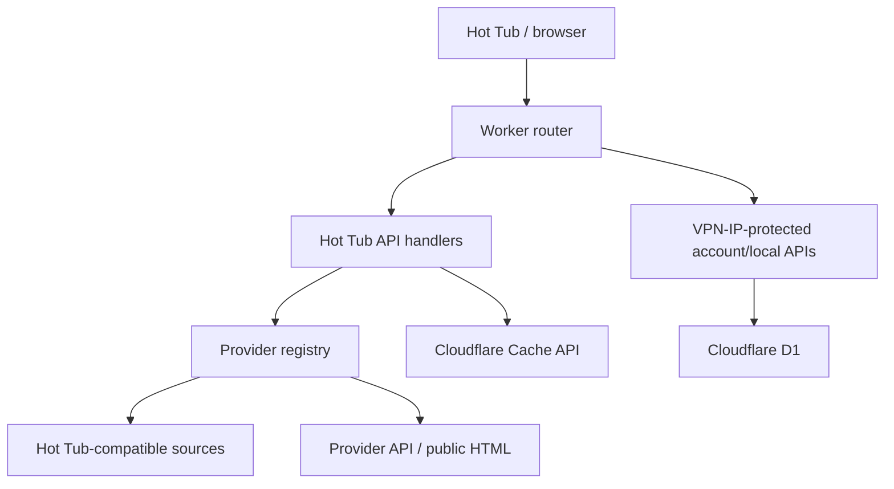

# Architecture

## Overview

The service is a single Cloudflare Worker with a D1 database. The Hot Tub
protocol layer owns validation and response shape; provider adapters own
provider-specific URLs, capability declarations, and normalisation.

There is no media proxy or media store. Provider watch pages and metadata travel
to Hot Tub; the Worker does not download video content.

## Layers

### Request routing

`src/router.ts` maps an explicit method/path pair to each handler. Unknown paths
return `404`; known paths with the wrong method return `405`. The outer boundary
adds a correlation ID, security headers, structured completion logs, and a
sanitised error envelope.

### Hot Tub protocol

`src/hottub/schemas.ts` contains the accepted request and emitted response
schemas. API handlers:

1. read at most 64 KiB;
2. parse JSON, plain JSON, or form encoding as appropriate;
3. validate/coerce the request;
4. call adapters using provider-neutral types;
5. discard provider items that fail the output schema or claim the wrong
   channel;
6. validate the complete response before sending it.

The protocol boundary is deliberately independent of provider response shapes.

### Provider adapters

Every adapter implements `ProviderAdapter` and declares all capabilities. The
registry has six stable IDs:

- `xhamster`
- `faphouse-ultra`
- `xvideos`
- `pornhub`
- `fpo`
- `eporner`

All six IDs have real catalogue adapters. Eporner uses its official API plus
Hot Tub-compatible fallbacks. xHamster, XVideos, and Pornhub use compatible Hot
Tub sources. fpo.xxx and FapHouse use strict public HTML catalogue adapters;
FapHouse playback remains deliberately unavailable. A failure in one adapter
does not fail a successful multi-channel request.

### Browse and search flow

`POST /api/videos` gives `channels` precedence over `channel`, matching the
current Hot Tub contract. Selected adapters run concurrently. Results are
schema-checked, filtered using `blockedKeywords` and `blockedUploaders`, and
round-robin merged up to `pageSize`.

The direct Eporner route maps:

- Hot Tub page/page size to `page`/`per_page`;
- browse to the documented special query `all`;
- supported sort IDs to Eporner order IDs;
- `orientation` and `quality` channel options to the documented `gay` and `lq`
  values.

It validates both the API payload and every returned provider URL. Compatible
upstream records are independently schema-checked and hostname-checked. Safe
custom Hot Tub options are forwarded, while routing fields and local block
lists are removed.

### Cache

Only public video responses use the Cache API. The key is a SHA-256 digest of a
deterministically sorted request object, so it incorporates selected providers,
query, pagination, filters, blocks, and client version. Responses use a
60-second public TTL plus 300 seconds of stale-while-revalidate.

A second exact-request cache keeps successful non-empty pages for seven days.
When every live route fails, the handler returns that last-known-good page with
`X-Cache: STALE`. All-provider failures are not inserted into either cache.

Account and local-library responses use `no-store` and are never shared. If a
future authenticated browse adapter is added, it must bypass the public cache or
include an opaque per-user partition in the key.

### Rate limits

D1 implements fixed-window counters:

| Scope          |                       Limit |
| -------------- | --------------------------: |
| Status         |      120 requests/minute/IP |
| Videos         |       60 requests/minute/IP |
| Uploaders      |       60 requests/minute/IP |
| Account reads  | 120 requests/minute/account |
| Account writes |  30 requests/minute/account |
| Local reads    | 120 requests/minute/account |
| Local writes   |  60 requests/minute/account |

Public traffic fails open if the counter store is unavailable, preserving source
availability. Private traffic fails closed because a missing admin rate limit
weakens a private-data boundary. Stored keys hash the public IP or stable
single-admin identity.

### Authentication and local data

The Worker checks Cloudflare's `CF-Connecting-IP` against the exact,
comma-separated `ADMIN_ALLOWED_IPS` allowlist. Production defaults to the fixed
VPN egress address `92.71.54.161`; other or missing addresses fail with `403`.
Forwarded-IP headers are not used for this private-route decision.

The D1 `user_key` is a stable SHA-256 digest for the single operator, so a
deliberate VPN-address change preserves local records. State-changing requests
also require an exact same-origin `Origin` and a constant-time checked
double-submit CSRF token stored in a secure, host-only, HTTP-only,
SameSite=Strict cookie.

Provider connection storage exists for future authorised OAuth/token adapters.
Tokens are AES-256-GCM encrypted with context-bound additional authenticated
data. No current provider exposes a connection flow.

## Data model

The first migration creates:

- `provider_connections`
- `local_history`
- `local_favourites`
- `local_playlists`
- `local_playlist_items`
- `followed_uploaders`
- `sync_state`
- `rate_limits`

Local records are private conveniences, not provider synchronisation. The
`sync_state` table is reserved for a future provider that genuinely supports
incremental sync.

## Failure model

- Invalid client input: stable `4xx` JSON error with a request ID.
- Invalid generated output: `502 invalid_output`.
- Provider network/schema failure: empty provider page and a generic,
  non-sensitive message.
- One failed provider in a multi-provider request: successful items plus
  `pageInfo.message`.
- All selected providers unavailable after a prior success: valid saved result
  plus `pageInfo.message`.
- All selected providers unavailable without a saved success: valid empty
  result plus `pageInfo.error`.
- D1 health failure: `/health` returns `503`.
- Source IP not allowed: `403`; IP allowlist configuration absent: `503`.

Stack traces, upstream bodies, fetch URLs, tokens, cookies, and viewing-history
data are not returned or logged.

## Intentional omissions

- No KV or R2: D1 and Cache API cover the real requirements.
- No headless browser, browser stealth, script execution, or anti-bot bypass.
- Public HTML catalogue parsing is limited to fpo.xxx and FapHouse and fails
  closed on challenges or incompatible markup.
- No direct-media URL extraction where the provider API does not supply an
  authorised stream.
- No popup or mixed browse-layout rows: the source needs neither to represent
  its current capabilities; simple leaf video arrays are compatible.
- No account-connect buttons: none of the six providers has a verified delegated
  authentication flow for this project.
